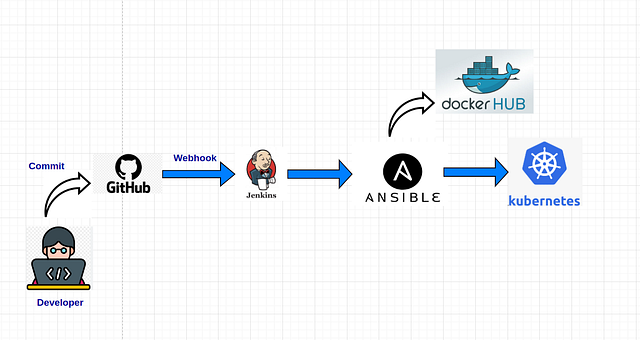
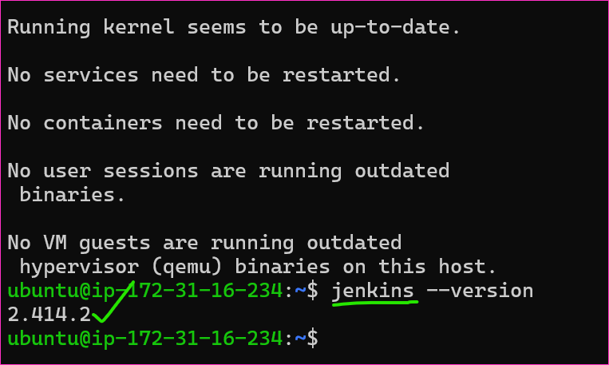
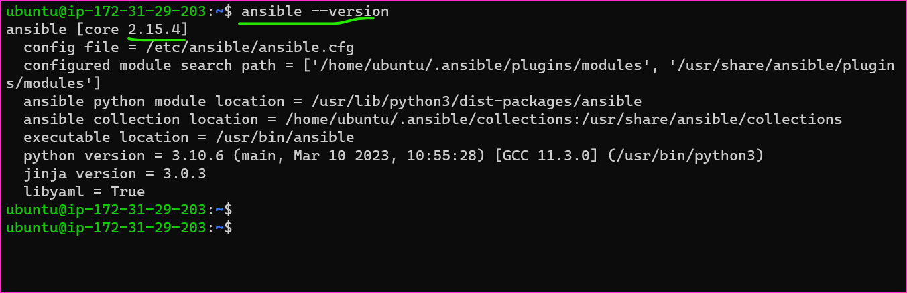
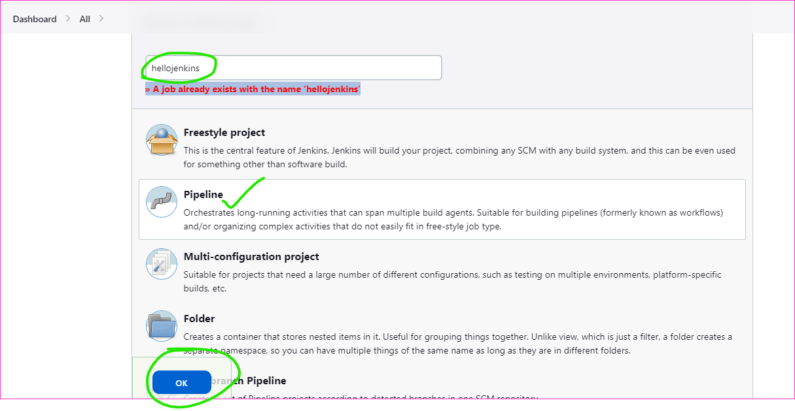
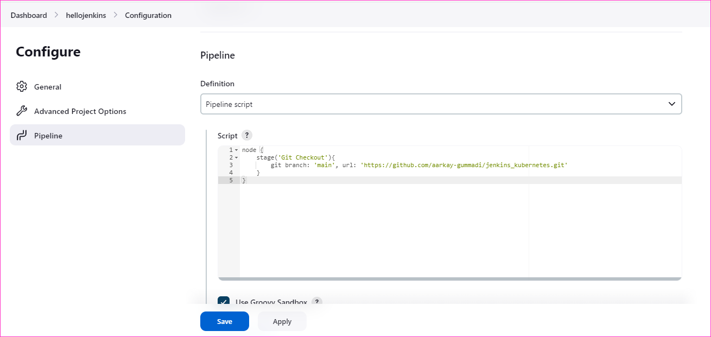
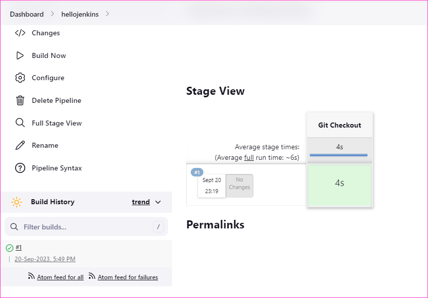

Real Time Complete Jenkins-Kubernetes DevOps Project
----------------------------------------------------
### Introduction

* In this project we will see deployment on kubernetes using jenkins CICD pipeline, A developer will write teh docker file and once he push the file on github or any commit occurred on github, it will notify the jenkins through webhook, jenkins will pull all the code from github repository and build the code after code building and testing jenkins will ssh to the ansible server and start executing the image, basically it will build the docker image based on the docker file pushed by the developer, once it build the image then it will tag it and push it to the docker hub.
* The second task of ansible server is to ssh the kubernetes cluster and run the playbook so run the kubectl command on k8s cluster and it will try to fetch the latest image from docker hub and using that image it will create the container and this will be access through service.

### Pre-Requisites
* Below are some pre-requisites to do this project.
    * Git, Linux, Jenkins, Docker, Docker Hub account, Ansible, Kubernetes, Three EC2 instances (jenkins, ansible, web app-> kubernetes cluster).

* Lets start the project.
    * First we will create three ec2 instances for jenkins and ansible t2.micro and for kubernetes use the t2.medium instance.


* Next task is to configure all the servers.

* First we will configure jenkins server.
* Run the below commands to install jenkins on ubuntu.
```
sudo apt update
sudo apt install openjdk-11-jdk -y
curl -fsSL https://pkg.jenkins.io/debian-stable/jenkins.io-2023.key | sudo tee \
  /usr/share/keyrings/jenkins-keyring.asc > /dev/null
echo deb [signed-by=/usr/share/keyrings/jenkins-keyring.asc] \
  https://pkg.jenkins.io/debian-stable binary/ | sudo tee \
  /etc/apt/sources.list.d/jenkins.list > /dev/null
sudo apt-get update
sudo apt-get install jenkins -y 
jenkins --version
```


* Once jenkins is installed allow port 8080 in its security group and access jenkins with its public ip and port 8080 for initial configurations.
* Once jenkins is ready install the ssh plug in jenkins.
* Now we will install ansible on ansible ec2 server.

```
sudo apt update
sudo apt install software-properties-common -y
sudo add-apt-repository --yes --update ppa:ansible/ansible
sudo apt install ansible -y 
ansible --version
```


* After install ssh to the kubernetes server and install docker and k8s on it.
* Docker
* K8s

* So our all three servers are ready, now we see how github will intimate jenkins whenever there is new commit in github and then jenkins start building the job.

* Write a docker file which will build the image.
* Now we will push this to our git hub repo.
* Push the docker file on github.
* Now go to your jenkins server there we will configure pipeline.


* Now we will write the script for our pipeline.


* Now build the pipeline.


* It have downloaded the dockerfile from github to jenkins ec2 server.


* Now we will configure webhook so whenever any commit occur this pipeline will trigger auto.
* Now come to the github repo setting and click on webhook option and add webhook.
* API token is generated through jenkins and use in github webhook's secret.
* Make any commit in the github code it will auto build the job.
* Now we will see how to send our docker file on the ansible server using ssh agent, along with that we will build the docker images on the ansible server.
* For this we will add one more stage in jenkins scriptive scipt.
* First we will generate new ssh agent for docker hub through pipeline syntax and use it in script.
* Note: 
    * For ssh agent use the pipeline syntax -> sshagent -> then use ansible username and its private.pem key to generate the syntax.
* Once save it build the jenkins job again to check the status.
* So we have docker file on ansible server now we will build and tag the image from that docker file, for this we will again write a new stage in jenkins script.
* After build is successfully created the docker image in ansible server.
* Before pushing the image to docker hub we have to tag the image, add new stage.
* Now we will push these images to the dockerhub.
* But first we will generate the password credentials of docker hub through pipeline script so that we do not write the plain text password in jenkins script.
* Now add the new stage that will push the docker image on docker hub.
* Once stage is configured then build the job.
* Check on the docker hub there will be a repo with this new images.
* Now we will see how ansible will run the playbook on k8s cluster, and kubernetes cluster will fetch the images from docker hub and based on that images it will start deploying the containers on cluster.
* Lets start writing the yaml files for kubernetes.


* Now make ssh connection between ansible and kubernetes.
* Set the root password on kubernetes instance.
* Then edit the ssh config file.
* Restart the ssh service.
* Now generate ssh key on ansible server.
* Now copy the ssh public key at ansible on kubernetes instance.
* Now edit the ansible host file and define ip of kubernetes there.
* Check the ping.


* Now we will write another stage in jenkins in which jenkins server will transfer the file to kubernetes server also like ansible.
* So create the ssh keys on jenkins as did on ansible and transfer it on the kubernetes server.
* This time we created the ssh agent using kubernetes private.pem key file so that jenkins will be able to access kubernetes server as we did for ansible.
* Now test the code.
* Now commit the all yaml files so that we will have those files in ansible and kubernetes server.
* In next stage we will run kubectl commands on jenkins to run the deployment and server file so that it create the pods for us.
* Our cluster is ready and pod are deployed.
* Check the server.
* Check on the browser on port 31200.


### THANK'S FOR READING!